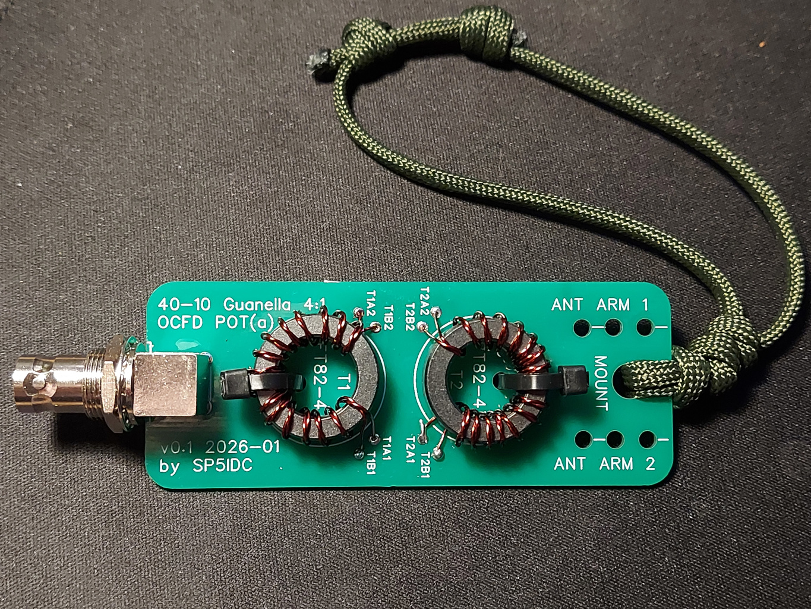
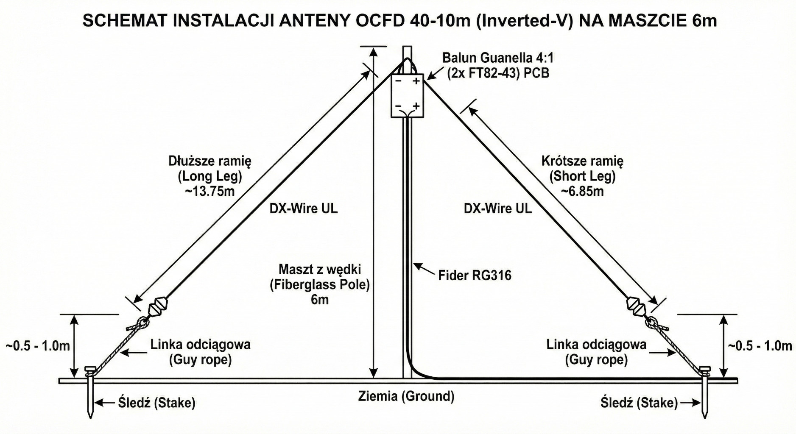
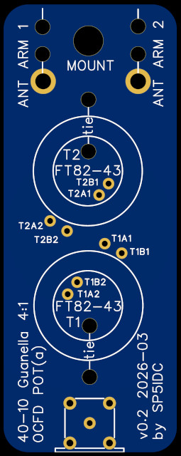
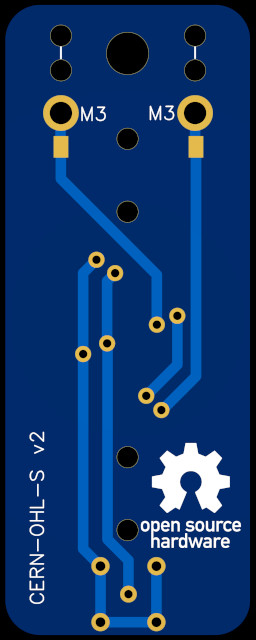

*Przeczytaj w innym języku: [🇬🇧 English](README.md)*

# OCFD POTA - Balun Prądowy Guanella 4:1 (2x FT82-43)

Ten projekt to płytka drukowana (PCB) dla lekkiego i wydajnego baluna prądowego (Current Balun) w układzie Guanella 4:1. Projekt został stworzony z myślą o pracy w terenie (SOTA, POTA, praca z wędki) i idealnie nadaje się do zasilania asymetrycznych anten drutowych, takich jak OCFD (Off-Center Fed Dipole).

Płytka ma wąski profil (35 mm x 90 mm), dzięki czemu stawia minimalny opór wiatrowi i idealnie układa się wzdłuż szczytówki wędki węglowej lub z włókna szklanego. Posiada zintegrowany otwór nośny na zawieszkę i otwory na opaski zaciskowe do unieruchomienia rdzeni.

## Założenia projektu
Mała terenowa antena możliwa do przenoszenia w plecaku razem z małą wędką lub mniejszym masztem turystycznym. Wykorzystując ramiona o długościach ~7 m i ~14 m zakłada pracę na pasmach 40-20-10m bez skrzynki antenowej. Zakładane jest jej niskie rozwieszenie gdzieś na wysokości ~6m.
Pasmo 40m praca w NVIS przydatne do lokalnych aktywacji terenowych, programów POTA, czy pracy EMCOM.
Pasmo 20m do pracy po świecie z lekką charakterystyką DX, najlepsze dopasowanie.
Pasmo 10m do cieszenia się z obecnego cyklu słonecznego.

Przewidywana skuteczność przy użyciu zakładanej długości ramion o łącznej rozpiętości ~21 m.
* **40m** - SWR 1.3:1 - 1.6:1 - Tryb NVIS ze względu na przewidywane niskie zawieszenie (~6m)
* 30m   - SWR > 5.0:1 - Nie stroi
* **20m** - SWR 1.1:1 - 1.4:1 - Przewidywane najlepsze pasmo pracy
* 17m - SWR 2.5:1 - 3.5:1 - Wymagana skrzynka antenowa
* 15m - SWR 3.0:1 - 6:0:1 - Nie stroi
* 12m - SWR 2.0:1 - 3.0:1 - Wymagana skrzynka antenowa
* **10m** - SWR 1.5:1 - 2.0:1 - Przewidywana możliwa praca bez skrzynki antenowej

## Parametry i możliwości
* **Typ układu:** Balun prądowy (Guanella) 4:1
* **Rdzenie:** 2x Amidon FT82-43 (jeden nad drugim)
* **Przeznaczenie:** Praca terenowa, QRP, lekkie anteny drutowe (optymalny dla pasm od 80m do 10m).
* **Szacowana bezpieczna moc (przy SWR < 2:1 i drucie 0.5 mm):**
  * **SSB:** do 100W (praca dorywcza, idealne dla radii typu 50W)
  * **CW:** do 50W
  * **FT8 / tryby cyfrowe:** 15W - 20W (przy pracy ciągłej należy kontrolować temperaturę rdzeni)

## Lista części (BOM)
To projekt typu "zrób to sam", płytka nie posiada elementów SMD do montażu fabrycznego. Aby złożyć balun, potrzebujesz:
1. **Płytka PCB** (wykonana z plików z folderu `fabrication/`).
2. **Gniazdo RF:** 1 szt. złącza BNC kątowego (do druku, przykładowe gniazdo wykorzystane przeze mnie: https://pl.aliexpress.com/item/1005003804586650.html).
3. **Rdzenie ferrytowe:** 2 szt. Amidon FT82-43.
4. **Drut nawojowy:** Drut w emalii (DNE) o średnicy **od 0.5 mm do maksymalnie 0.8 mm** (większe średnice, np. 1 mm, nie przejdą przez standardowe otwory lutownicze na tej płytce).
5. **Elementy montażowe:** Małe opaski zaciskowe (trytytki) do zamocowania rdzeni do PCB.

## Instrukcja montażu

### 1. Nawijanie rdzeni (Transformatory T1 i T2)
Oba rdzenie należy nawinąć identycznie.
* Użyj linii dwuprzewodowej (najlepiej dwa druty w emalii skręcone lekko ze sobą lub prowadzone równolegle). Można użyć drutów o dwóch różnych kolorach emalii, aby nie pomylić żył (np. drut "A" i drut "B").
* Nawiń optymalnie **14 zwojów bifilarnych** na każdym z rdzeni. Przy drucie 0.5 mm zmieszczą się one bez problemu, a taka ilość zwojów zapewni świetne parametry na pasmach 40m i 80m.
* Zostaw po 2-3 cm drutu, resztę odetnij.
* Usuń np mechanicznie emalię z końcówek drutu, określ sobie multimetrem końće drutów.

### 2. Lutowanie do PCB
Układ Guanella 4:1 działa na zasadzie **równoległego połączenia wejść i szeregowego połączenia wyjść**. Ścieżki na PCB realizują odpowiednią logikę tego połączenia.

Odpowiednie przylutowanie końcówek drutów we właściwe pola ma krytyczne znaczenie do działania baluna.

Na płytce jest zastosowany opis w postaci:
* **T1A1** - Rdzeń T1, drut A, koniec 1
* **T1A2** - Rdzeń T1, drut A, koniec 2 (drugi koniec tego samego drutu A)
* **T1B1** - Rdzeń T1, drut B, koniec 1
* ...

Z tyłu na płytcę znajdują się dwa pady, do których należy przylutować końce promiennika. Przy nich też są otwory przez, które należy promiennik przewlec.
Z uwagi na symetrię baluna, nie ma znaczenia, które ramię OCFD podłączysz do lewego, a które do prawego padu.

Przeciągnij opaski zaciskowe przez otwory w PCB i solidnie unieruchom rdzenie.
Zwoje nie powinny się przesuwać. Jeśli nie wystarczy opaska zaciskowa użyj jeszcze kleju lub lakieru.

### 3. Promiennik i strojenie
Aby mieć zapas do strojenia, utnij odcinki o następujących długościach:
* Dłuższe ramię: **14 m**
* Krótsze ramię: **7 m**
Całkowita długość ok 21 m.

Po dopasowaniu analizatorem w terenie, wymiary prawdopodobnie zbliżą się do wartości:
* **13,75 m**
* **6,85 m**

Przy skracaniu trzeba pamiętać o zachowaniu proporci między ramionami **67% / 33%**.
Zawsze zachowuj stosunek **2:1** przy docinaniu.

## Jak zamówić płytkę u producenta
Jeśli chcesz wyprodukować tę płytkę (np. w serwisie JLCPCB, PCBWay), postępuj zgodnie z poniższymi krokami:
1. Pobierz plik Gerber ZIP znajdujący się w folderze `fabrication/`.
2. Prześlij ten plik na stronie wybranego producenta PCB.
3. Wybierz standardowe ustawienia grubości laminatu (**1.6 mm**) oraz standardową grubość miedzi (**1 oz** / 35 µm). Płytka posiada odpowiednio dobrane ścieżki i pola lutownicze.

## Historia wersji (Changelog)
* **v0.2** (2026-03-04)
  * Powiększenie otworów na drut nawojowy, co umożliwia bezproblemowe użycie grubszego drutu o średnicy 1 mm.
  * Zmiana lokalizacji pól lutowniczych dla uzwojeń rdzeni w celu lepszego i wygodniejszego ułożenia drutu.
  * Dodanie pola kontaktowego i powiększenie otworu na promiennik anteny do rozmiaru M3. Umożliwia to trwałe i wygodne mocowanie promiennika za pomocą konektora oczkowego, śruby M3 i nakrętki motylkowej.
* **v0.1** (2026-02-24)
  * Pierwsze publiczne wydanie projektu.

## Licencja (License)
Copyright 2026 Maciej Chmielewski SP5IDC

This Source describes Open Hardware and is licensed under the CERN-OHL-S v2.

You may redistribute and modify this Source and make products using it under the terms of the CERN-OHL-S v2 (https://ohwr.org/cern_ohl_s_v2.txt).

This Source is distributed WITHOUT ANY EXPRESS OR IMPLIED WARRANTY, INCLUDING OF MERCHANTABILITY, SATISFACTORY QUALITY AND FITNESS FOR A PARTICULAR PURPOSE. Please see the CERN-OHL-S v2 for applicable conditions.

Source location: https://github.com/sp5idc/ocfd_pota

As per CERN-OHL-S v2 section 4, should You produce hardware based on this Source, You must make the complete, corresponding Source available under the same licence.
---
*Projekt udostępniany jako Open Source Hardware.*
